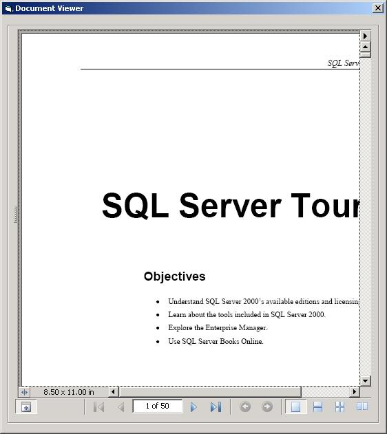



## Demo: How to use Adobe Acrobat Reader 7\.0 Viewer Control \(AcroPDF\.dll\)

### Description

This code demonstrates how to use the Adobe Acrobat 7.0 Browser Control (AcroPDF.dll) with Visual Basic 6.0. Commented and Explained for beginners use.

Requires Adobe Acrobat Reader to run. Minimum version is 7.0
 
### More Info
 
Requires Adobe Acrobat Reader to run. Minimum version is 7.0

             |
---                |---
**Submitted On**   |2007-09-06 12:44:02
**By**             |[Julius Earvin Enerio](https://github.com/Planet-Source-Code/PSCIndex/blob/master/ByAuthor/julius-earvin-enerio.md)
**Level**          |Beginner
**User Rating**    |4.8 (58 globes from 12 users)
**Compatibility**  |VB 6\.0
**Category**       |[Miscellaneous](https://github.com/Planet-Source-Code/PSCIndex/blob/master/ByCategory/miscellaneous__1-1.md)
**World**          |[Visual Basic](https://github.com/Planet-Source-Code/PSCIndex/blob/master/ByWorld/visual-basic.md)
**Archive File**   |[Demo\_\_How\_208220962007\.zip](https://github.com/Planet-Source-Code/julius-earvin-enerio-demo-how-to-use-adobe-acrobat-reader-7-0-viewer-control-acropdf-dll__1-69282/archive/master.zip)

